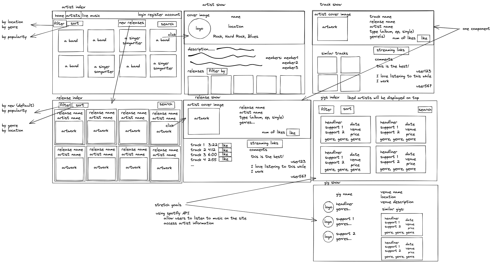

#  Project 4: Local Music NI
By Dominic Reynolds

## Overview
My fourth and final project for General Assembly’s Software Engineering Immersive course was to build a full stack application using React.js for the front end and Django.py for the back end. We had the option of going solo, or working in a group. I decided to work by myself for this one, as the project was personal to me. I created a website which would be able to display information about the local music artists in Northern Ireland, and where gigs could be posted and found. This required me to create a larger back end than my peers, with 36 tables, it was more complicated than I had anticipated.
- - - -

## Technologies Used
- - - -
* React.js
* Django.py
* SCSS
* Table Plus
* PostgreSQL
- - - -

## Approach Taken
- - - -
### Back End Preparation

Due to the complexity of the project, it required thorough planning before I even wrote a line of code. I began by creating a ERD diagram to map out the tables in the back end. Even though I diverged a little from the original plan, this was an essential phase in order to be ready to create my project. 
As there were a large number of tables and relationships, I spent time thinking about what I would need and how the tables would relate to each other. Such as by foreign key or with a many to many relationship. 


- - - -
### Front End Preparation

I decided that I wanted to display the index pages for the Artists and releases in a similar way the Spotify desktop client, with the artwork being displayed on cards, all of which are a link to a display page.  Using Excalidraw.com, I white boarded out my planned layout for each page that would be needed to display data.  

- - - -
### Building the PostgreSQL database using Django.py

#### Set Up and Models
I began by setting up the Django.py project using PipEnv in a Git folder. I then used my ERD diagram to create the models, each table had to relate to each other in many different ways, this made the planning I had done pay off. The way the database need up looking wasn’t identical to the ERD diagram, as as I began to implement it, I realised that I would need to do it in different ways to get it to work correctly. Django.py handles the foreign key and many to many relationships, which made building the models easy as I only had to make 11 tables. The number of many to many relationships is the main reason why there ended up being 36 tables in the database when I had finished building it. 

```
class Artist(models.Model):
    name = models.CharField(max_length=100)
    description = models.TextField(max_length=500)
    year_formed = models.IntegerField()
    logo = models.CharField(max_length=300, blank=True)
    cover_image = models.CharField(max_length=300, blank=True)
    location = models.CharField(max_length=200)
    genres = models.ManyToManyField(
        Genre, 
        related_name='artists', 
        blank=True
    )
    links = models.ManyToManyField(
        Link,
        related_name='artists',
        blank=True
    )
    musicians = ManyToManyField(
        Musician,
        related_name='artists',
        blank=True
    )
    favorited_by = ManyToManyField(
        User,
        related_name='favorite_artists',
        blank=True
    )
    owner = ForeignKey(
        User,
        related_name='artist_owner',
        on_delete=CASCADE,
        null=True,
        default=1
    )

    def __str__(self):
        return f'{self.name}'
```
- - - -
#### Requests

I decided to make my requests in a separate hooks folder as I knew that this code would be repeated frequently if I did not.  Each request was a function, in which the necessary parameters would be passed into in order to manipulate the database and retrieve information from it. 

```
def get_all(model, serial):
    data = model.objects.all()
    serialized_data = serial(data, many=True)
    return Response(serialized_data.data, status=status.HTTP_200_OK)

def create(request, serial):
    serialized_data = serial(data=request.data)
    if serialized_data.is_valid():
        serialized_data.save()
        return Response(serialized_data.data, status=status.HTTP_201_CREATED)
    return Response(serialized_data.errors, status=status.HTTP_422_UNPROCESSABLE_ENTITY)

def get_row(model, pk):
    try:
        return model.objects.get(pk=pk)
    except model.DoesNotExist:
        raise NotFound()

def get_one(model, serial, pk):
    data = get_row(model, pk=pk)
    serialized_data = serial(data)
    return Response(serialized_data.data, status=status.HTTP_200_OK)

def delete_one(model, pk):
    data = get_row(model=model, pk=pk)
    data.delete()
    return Response(status=status.HTTP_204_NO_CONTENT)

def update_one(model, serial, request, pk):
    data = get_row(model=model, pk=pk)
    updated_data = serial(data, data=request.data)
    if updated_data.is_valid():
        updated_data.save()
        return Response(updated_data.data, status=status.HTTP_202_ACCEPTED)
    return Response(updated_data.errors, status=status.HTTP_422_UNPROCESSABLE_ENTITY)

def favorite(model, serial, request, pk):
    permission_classes = (IsAuthenticated, )
    try:
        data = model.objects.get(pk=pk)
        if request.user in data.favorited_by.all():
            data.favorited_by.remove(request.user.id)
        else:
            data.favorited_by.add(request.user.id)
        data.save()
        serialized_data = serial(data)
        return Response(serialized_data.data, status=status.HTTP_202_ACCEPTED)
    except model.DoesNotExist:
        raise NotFound()
```

- - - -
#### Views

I initially built two views for every individual model that I would be displaying, one populated for detailed view and the other unpopulated for list view.  This ended up being a lot of repeated code, so instead, in my hooks folder I would store base view classes for list and detail that I would call and pass in the individual models that I would need. In these classes I would call the requests that I mentioned above as methods in the classes. I additionally created a favourite view that would allow for users to favourite the things that they like the most. I then called these views for each model and passed in the appropriate serializer as seen below. Finally, I created a URL and serialiser for each view, to allow for the front end to make requests.

```
class ListView(APIView):
    def __init__(self, model, serial):
        self.model = model
        self.serial = serial

    def get(self, _request):
        return get_all(self.model, self.serial)
    
    def post(self, request):
        return create(request, self.serial)

class DetailView(APIView):
    def __init__(self, model, populated_serial, serial):
        self.model = model
        self.populated_serial = populated_serial
        self.serial = serial

    def get(self, _request, pk):
        return get_one(self.model, self.populated_serial, pk)
    def delete(self, _request, pk):
        return delete_one(self.model, pk)
    def put(self, request, pk):
        return update_one(self.model, self.serial, request, pk)
```

```
class ArtistListView(ListView):
    def __init__(self):
        self.model = Artist
        self.serial = ArtistSerializer

class ArtistDetailView(DetailView):
    def __init__(self):
        self.model = Artist
        self.populated_serial = PopulatedArtistSerializer
        self.serial = ArtistSerializer
```
- - - -
#### Adding the Data

In order to add the initial data to the database, I had to use the Django.py admin app. I added some of the local music artists I knew and filled in their discographies. This was essential for me to be able to start building the front end, as I required data to work with. 
- - - -
### Building the Front End In React.js

#### Set Up

In order to be ready to build all of the components I needed, I had to connect my React.js app to my back end. I created a file called api.js and used this to create my requests, for example: getOneArtist(artistId) or getAllArtists(). Using console.log(), I checked if I was getting the correct JSON from the requests.
- - - -
#### Index Pages

I wanted these index pages to show multiple cards with the logo and artwork for the artists and releases respectively, the name was to be displayed underneath.  I created a card component, which was used to display one artist or release. Upon navigating to an index page, a get all request would be made for the artists or releases, this information would then be mapped onto the page using the display cards. An original array of objects would be created, and then filtered into another array, depending on what the user wants to see (this filtered array starts the same as the original). I wanted the display cards to adapt to the screen size, to do this I used 5 media queries, and made the card size change depending on the screen width. I found SCSS very helpful for this as I could nest the queries inside of the display card class, it took some fine tuning to get this right. For the gig index page, I created a different card that displayed more information than for artists and releases. There are also more options to filter with the gig page.


```
export default function DisplayCard({ name, logo, artwork, id, handleClick, table, cardType }) {
  console.log(cardType)
  return (
    <div className={`${cardType}-display-card`} key={name} onClick={() => handleClick(table, id)}>
      
      <h4>{name}</h4>
    </div>
  )
}

```

```
<div className="artist-index">
        {filteredArtists &&
          filteredArtists.map(artist => (
            <DisplayCard
              key={artist.name}
              handleClick={handleClick}
              table="artists"
              cardType="adaptive"
              {...artist}
            />
          ))
        }
</div>
```

```
.adaptive-display-card {
  background-color: $darkest-grey;
  text-align: center;
  border-bottom-left-radius: 20px;
  border-bottom-right-radius: 20px;
  margin: 5px;
  h4 {
    margin: 10px 0;
  }
  &:hover {
    @include hover-pointer;
  }

  @media (min-width: 1551px) {
    @include card-size(13.6vw);
  }
  @media (min-width: 1231px) and (max-width: 1550px) {
    @include card-size(15.8vw);
  }
  @media (min-width: 1024px) and (max-width: 1230px) {
    @include card-size(19vw);
  }
  @media (min-width: 768px) and (max-width: 1023px) {
    @include card-size(23.5vw);
  }
  @media (max-width: 767px) {
    @include card-size(31vw);
  }
}
```

- - - -
#### Show Pages

For each artist, release and gig, I created a show page to display them. Using a get one request, I then displayed this data on the page, with all of the information that a user would like to see, as well as links to related pages. For example: from the artist show page,  the user can navigate to the release show page for any of their Albums, EPs and Singles. Additionally, users can favourite the things they like, and if they are the one who added the information to the database, it is possible to edit it.
- - - -
#### Auth and Account

I created a register and login page, this was fairly simple as I had done this before in project 3. They are forms that send requests to the back end. I was careful to just let the user not know what part of their login details were incorrect. On the account page, everything that they have favourited is displayed using side scrolling rows, by using: `overflow-x: auto;`. 
- - - -
#### Create and Edit Forms

As there are so many different tables in the back end, I had to create numerous forms in order to allow for users to upload this information onto the site to be displayed. In order to create a gig, I had to have the option of adding a new artist and venue to the database as this information is required for the gig. To do this I added a button for each, which would embed the create artist or venue form into the create gig form. After these were added, they would then be displayed in their relevant select box. In order to add genres to the artists and releases, I used the creatable select box from the react-select library and utilised the ‘isMulti’ feature. For editing the artists, I used the same form as in the create gig, however I used a put request instead of a post. 
- - - -
## Future Features

#### Connecting to Spotify

I had a stretch goal of connecting the site to Spotify, I began trying to get this to work using OAuth, and I found that I was spending a lot of time on this and I realised that I had more important things to work on. As this was my first time attempting to work with OAuth, I decided to put this aside until I had finished everything else. I aim to get this completed in the future. The idea was to use Spotify to fetch discographies for the database, to have  a player on the website and allow for users to add local music artists onto their Spotify accounts through the site. 
- - - -
#### Mailing List

Being able to let the users know of local gigs in their area that they may be interested in going to, and of new releases via email would be a good feature for the future and would help the local music scene grow. 
- - - -
#### Styling Improvements

The display pages could definitely be styled in a more aesthetic way. This is the same case with the home page
- - - -
## Known Bugs

* If a user attempts to create a new release, it must be posted before the songs are added. This caused me to workaround by making the user move to a new form, however if they navigate away, the tracks will not be added.
* The filter select for the gig index page does not remove the favourite options when the user is not logged in.
- - - -
## Issues

After the initial 10 day period that we were given to complete this project, I still had a few components to complete. I took a break from coding after graduating from GA for a week, and when I came back, I realised that I needed to add owners to a few of the models. In doing this, I set the default pk to be 0, which Django.py does not support. This caused the back end to break completely and I had to delete my whole database and re-seed in order to fix it. 
- - - -
## Key Learnings

This project really helped me with learning Python and getting it to a level that I am much more comfortable with, although I still prefer JavaScript. I gained a far greater understanding of the complex relationships that are possible with SQL and I now find myself able to visualise these relationships easily. Finally, my abilities with React improved and I now understand CSS/SCSS better.
